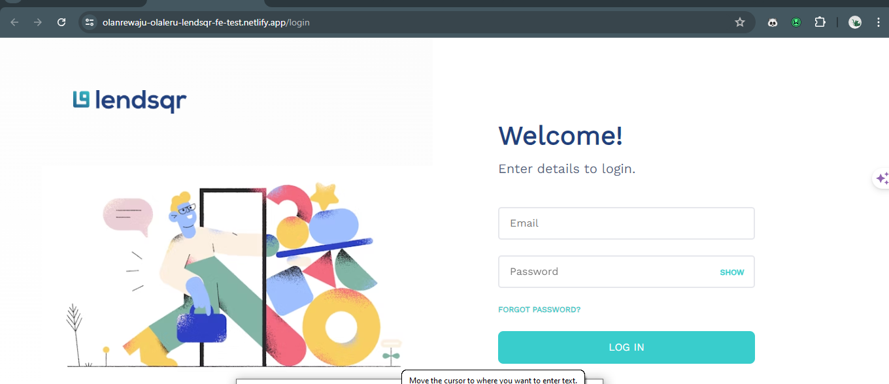

This is a [Next.js](https://nextjs.org/) project made in line with Lendsqr Frontend Engineering Assessment



## Getting Started

Ensure you have Node installed (version >=18.0.0) to use. Clone the repository and install dependencies (npm example):

```bash
npm install
```

Then run the development server:

```bash
npm run dev
# or
yarn dev
```

Open [http://localhost:3000](http://localhost:3000) with your browser to see the result.

## Application Usage

Login (as admin) using the following credentials:

Email: adedeji@lendsqr.com
Password: lendsqr-test

## Deployment information

This app was deployed on [netlify](https://app.netlify.com/)

## Mail

[Larry](mailto:olalerulanre@gmail.com)
